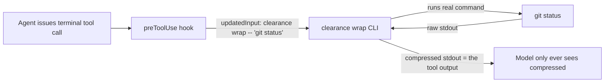

The question is whether VS Code Copilot's hook model exposes a seam where a post-tool script can **replace what the model reads** — that's the entire ballgame. If it can only log or append context, it saves zero tokens. Verifying against the actual VS Code hook implementation and docs:

## The hook contract, from `microsoft/vscode` source

The actual JSON contract from `extensions/copilot/src/platform/chat/common/hookCommandTypes.ts`:

| Event | stdin (input) | stdout can return |
|---|---|---|
| `preToolUse` | `tool_name`, `tool_input`, `tool_use_id` | `permissionDecision`, `permissionDecisionReason`, **`updatedInput`**, `additionalContext` |
| `postToolUse` | `tool_name`, `tool_input`, **`tool_response`**, `tool_use_id` | **`additionalContext` only** |

## Your specific proposal: dead end

**`postToolUse` + cleanup script saves zero tokens.** The hook receives the raw `tool_response` on stdin, but the output contract has no replacement field — no `updatedToolOutput`, no Antigravity-style `{"decision":"deny","reason":"<compressed>"}`. The only thing it can return is `additionalContext`, which *appends* to the context the model sees. The raw output is already in the transcript and ships in the next request regardless of what your script prints. This is exactly why token-saver couldn't do its compression in a Claude Code post-hook either — it's why they run at PreToolUse instead.

## But the question points at the right seam — one event earlier

`preToolUse` **does** expose `updatedInput`, and it's not decorative:

- https://github.com/microsoft/vscode/tree/main/extensions/copilot/src/extension/prompts/node/panel/toolCalling.tsx: `// Apply updatedInput from hook (input modification takes effect before invocation)` → `inputObj = hookResult.updatedInput`
- `languageModelToolsService.ts` validates `updatedInput` against the tool's input schema, so a malformed rewrite is rejected, not shipped.

That's token-saver's entire architecture, and it ports to VS Code 1:1:

The compression happens **at the source**: the transcript itself is smaller from that turn forward, instead of the proxy re-compressing history on every request. That's strictly less work per request than the current design.

## What this would delete

This is the part that matters against the last two rounds of discussion. The entire proxy stack — `overrideCapiUrl`/`overrideProxyUrl` (the fragile seam you were trying to escape), auth header forwarding, fail-closed 502, body rewriting, request logging infrastructure — becomes unnecessary for the core compression path. `settingsBlock.ts`'s marked-block machinery reuses as-is to manage a marked block in the hooks file instead of `settings.json`. The load-bearing risk drops from "GitHub removes an internal debug setting" to "GitHub changes hook semantics" — and hooks are a **public, documented, actively-built product surface** (telemetry events, schema validation, e2e suites).

## Costs, stated plainly

1. **The user sees compressed output.** The proxy compresses only what the model reads; the Copilot UI keeps showing raw output. With the hook, the terminal pill shows the compressed text. Arguably a feature (user and model agree on reality); it's a behavior change either way, and it's the one token-saver users have to accept.
2. **Coverage narrows to terminal-tool calls.** The proxy saw every tool output in the body. The hook sees what hooks fire on. Clearance's own design already skips source-file content, so the real delta is non-terminal tools (search, file reads) — which the current engine largely passes through anyway. Smaller coverage, mostly of noise the engine was ignoring.
3. **New trust surface: a wrapper executing arbitrary commands.** token-saver's hardening list is the spec: quote-aware exclusion (redirects, `sudo`, editors, background jobs), `sh -n -c` syntax check on rewrites, fail-open, recursion guard. That work exists in token-saver (Apache-2.0) and maps onto your engine; it's days, not weeks.
4. **One thing to verify before committing:** the terminal tool's name/matcher in agent-mode sessions, and that `updatedInput` is honored on that specific tool. The e2e suite (`mcpPluginSuite`) confirms hooks fire in agent sessions; the tool-name detail is an implementation check, not a risk to the design.

## Verdict correction

My previous "don't pivot" verdict assumed the proxy was the *only* deterministic seam. That was wrong — I had verified the network seam but not the input-rewrite seam, and the contract now shows `updatedInput` is applied and schema-validated. **`preToolUse` + a `clearance wrap` CLI is the sounder architecture for this product**: public surface instead of internal debug settings, one-shot compression at source instead of per-request transformation, and a deletion of the entire proxy risk stack. The proxy doesn't die — it becomes the fallback path for hook-incompatible surfaces (and the place file-read/search compression could live later).

**Recommended next step:** a two-hour spike, not a refactor — register a `preToolUse` hook in `.github/hooks/` matching the terminal tool, echo the `tool_input` JSON, and (if you're on a recent VS Code) confirm `updatedInput` round-trips on a real agent terminal call. If it does, I'll scope the wrapper + hook installer as the new primary path.